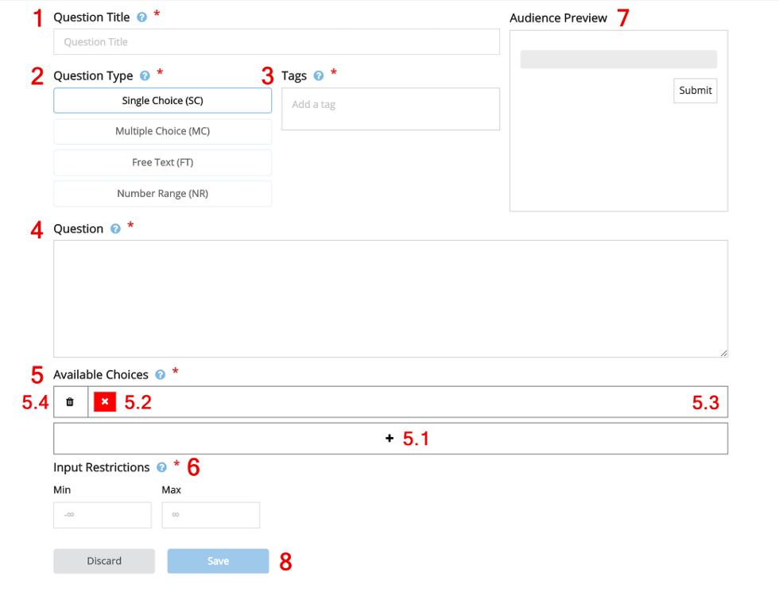

Before preparing a session, all questions need to be created. Every question has the following
attributes that need to be filled:

1. **Question Title:** A short title that summarizes the question. The title is
only visible for the speaker but not for the audience.

2. **Question Type:** Determines how a question can be answered by the audience:
    - _Single Choice (SC):_ Only one of the given answer may be selected.
    - _Multiple Choice (MC):_ Multiple of the given answers may be slected.
    - _Free Text (FT):_ The input is unrestricted (text answers).
    - _Number Range (NR):_ Selecting a number within a given range.

3. **Tags:** To sort the questions and simplifying filtering. Type in the tag or start typing and select an existing one and confirm a tag by pressing
Enter.

4. **Question:** The question to be answered by the audience.

5. **Available Choices (SC / MC only):** The available answers the audience may
choose from. Click the plus sign to add a new answer and type in the answer. Then click
the red cross or green tick to select whether the answer is correct or not and save the
answer with the button on the right. Delete answers with the button on the left.

6. **Input Restrictions (Number Range only):** The range the
answer needs to be in.

7. **Audience Preview:** On the upper left corner a preview of how the audience sees the question is showed.

8. **Save:** Press the save button on the bottom to save the question and display it within the question
pool (see next section).

