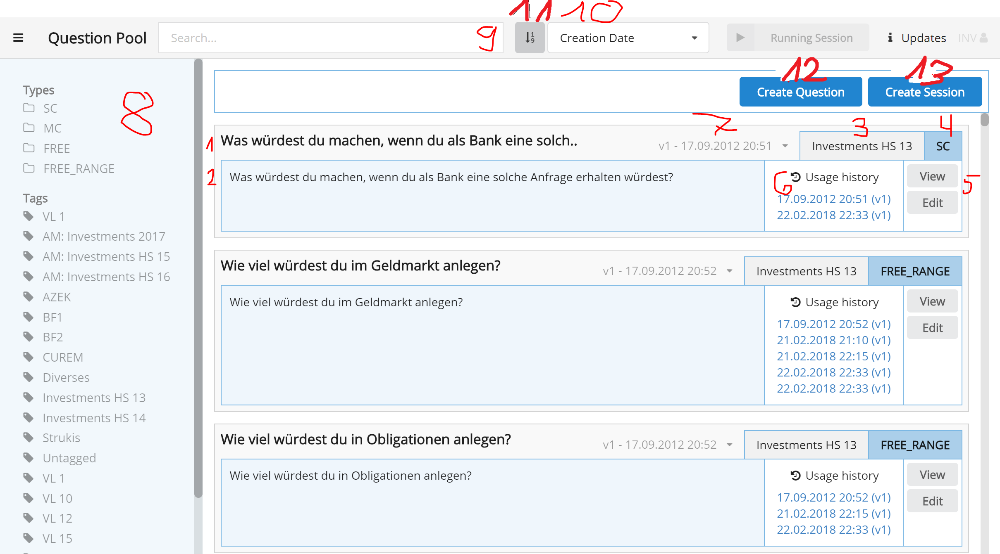

The Question Pool shows all available questions. The following information and actions are
showed for every question:

1. **Title:** The title of the question (only visible for the speaker).
2. **Question:** The question for the audience.
3. **Tags:** List of tags associated with this question.
4. **Type:** The type of the question (SC, MC, FT or NR).
5. **View / Edit**: View the whole question and edit it (only the title and the tags can be edited, create a new version
  to change the question and answers by clicking edit and new version).
6. **Usage History:** A list of all sessions where the question was used. Click on a link to see the evaluation.
7. **Version**: Indicates which version is displayed. Click to change the version.

The follwoing areas and buttons provide filtering options for the question list and allow to create new questions and sessions:

8. **Type/Tag**: Select question Types and/or Tags to filter the questions.
9. **Search**: Type in a text to search question title and questions.
10. **Sort**: Sort the questions according to their creation dates, last usage, question yypes or titles.
11. **Sorting Order**: Order the questions in ascending or descending order.
12. **Create Question**: Link to create a new question.
13. **Create Session**: Link to create a new session.

