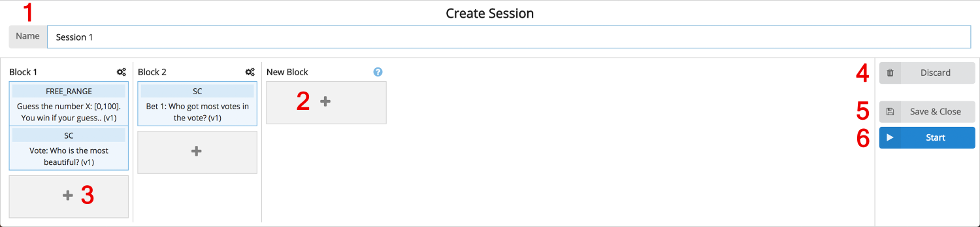

On the [Question Pool](doc4.md) screen, click _Create Session_ to start combining the questions for a new session.

Every session consists of blocks of questions. During an ongoing session, the speaker unlocks a question block so that the audience can answer all question within this question block.

The following steps need to be done to create a new session:

1. Enter a new name for the session (only visible to the speaker and not to the audience).
2. Drag & Drop a question from the question list here to create a new question block.
3. Drag & Drop a question from the question list here to add a question to an existing question block.

After all the questions are placed in a new session, there are two ways to save the session. Either
4. save and close the session or
5. save and start the session. You will be redirected to the [Running Session](doc7.md) screen.

