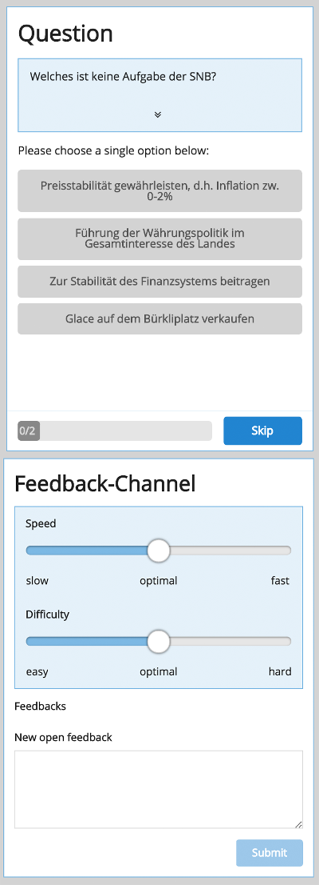

This page is presented to the audience to answer questions (left side) and give instant feedback (left side) to the speaker.

Moving the sliders for speed and difficulty instantly sends feedback to te speaker. The input box on the bottom enables
sending text feedback or questions to the speaker's session cockpit.

If questions get not displayed automatically after the speaker unlocks them, the webpage need to be reloaded.

For mobile devices the page is divided in two separate sections.

