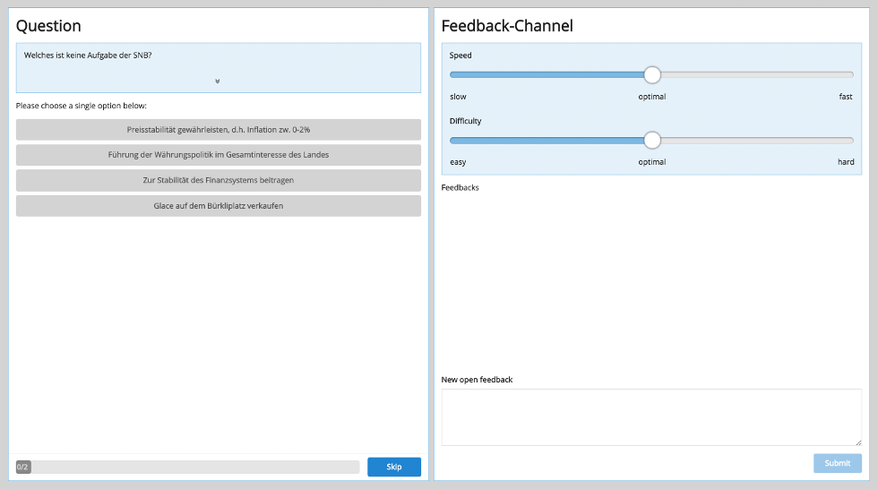

This page is presented to the audience to answer questions (left side) and give instant feedback (right side) to the speaker.

Moving the sliders for speed and difficulty instantly sends feedback to the speaker. The input box on the bottom enables sending text feedback or questions to the speaker's session cockpit.

**Notice that students need to reload this page after the activation of a new question block.**

For mobile devices, the page is divided into two separate sections.

